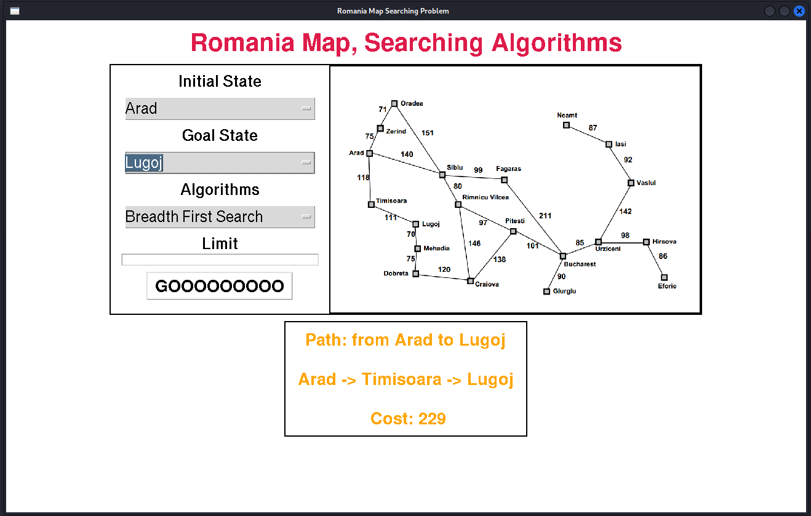
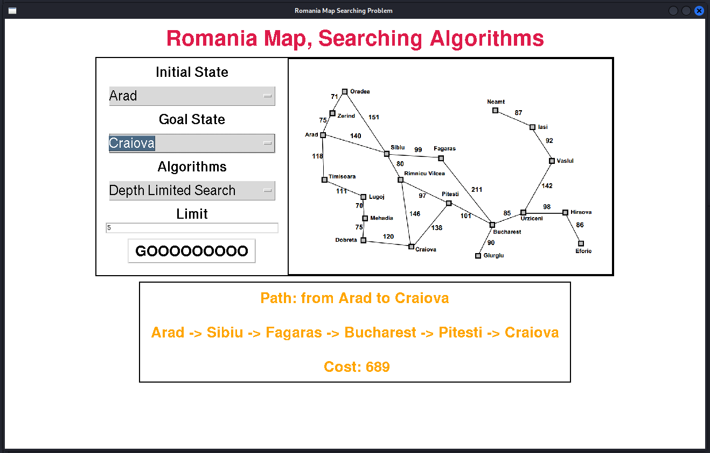
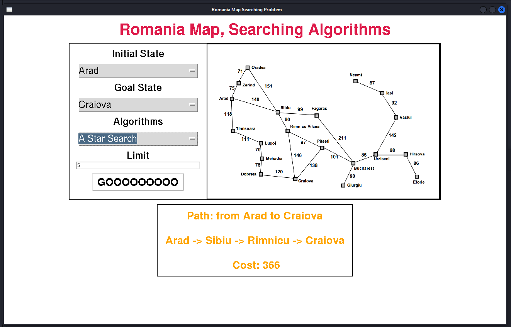

# Romania Map Searching Algorithms using Python Tkinter

This Python application provides a graphical interface (GUI) for exploring various searching algorithms (both uninformed and informed) on a map of Romania. The application is built using the Tkinter library for the GUI components.

## Features

- **Map Visualization**: Displays a map of Romania with different cities and connections.
- **Uninformed Search Algorithms**
- **Informed Search Algorithms**
- **Interactive Interface**: Allows users to choose the start and goal cities on the map.
- **Visualization of Pathfinding**: Shows the path found by the algorithms on the map.

## File Structure

- `main.py`: The main Python script containing the GUI implementation.
- `Algorthims.py`: The Python script containing the searching algorithms.
- `README.md`: This file providing instructions and information about the application.

## Searching Algorithm Implementations

- **Uninformed Search Algorithms**:
  - Breadth-First Search (BFS)
  - Depth-First Search (DFS)
  - Uniform Cost Search (UCS)
  - Depth-limited search
  - Iterative deepening depth-first search
  - Bidirectional BFS
- **Informed Search Algorithms**:
  - A* Search
  - Greedy Best-First Search

## GUI

## Contributing

Contributions are welcome! If you want to add new features, additional search algorithms, optimize existing algorithms, or improve the application in any way, feel free to open a pull request or raise an issue.